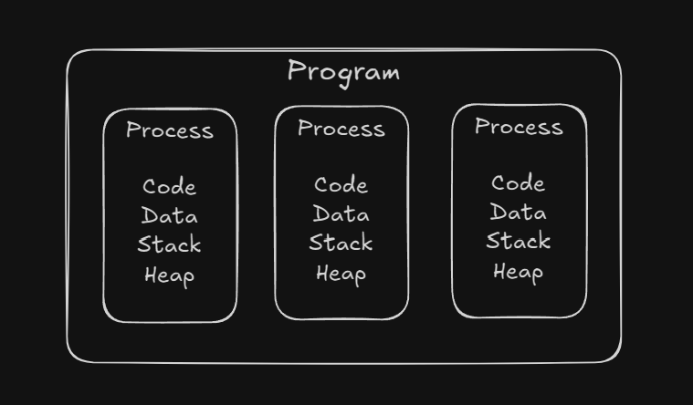

# Operating System

## Overview

Operating System (OS)는 사용자가 컴퓨터를 사용하기 위해 필요한 시스템 소프트웨어이다. OS는 컴퓨터의 HW와 SW의 자원을 관리해준다. 
OS는 오늘날 개발자가 알아야하는 필수 지식중 하나로 다음과 같은 아젠다로 복습을 할 수 있다. 

Agenda

- Kernel & System Call
- Process vs Thread
- Scheduling
- Virtual memory
- Address Translation, Paging, Swapping
- Concurrency
File System, Crash Consistency

## Kernel (커널) & System Call (시스템 호출)
커널: OS의 핵심으로 하드웨어와 소프트웨어를 연결하는 인터페이스다.
커널은 프로세스 관리, 메모리 관리, 하드웨어 자원 제어, 시스템 호출 관리를 해준다. 

시스템 호출: 사용자 프로그램이 커널의 기능을 요청하는 인터페이스이다. 
예시로 `read()`, `write()`, `fork()` 등이 있다. 

## Process (프로세스) vs Thread (스레드)
프로세스와 쓰레드의 차이를 알기전에 프로그램에 대해서 다시 한 번 집고 넘어가겠다.

프로그램이은 실행 파일(executable file)로 실행을 하기전 까지는 저장 장치에 저장만 되어있는 상태이며,아직 메모리에 할당이 안되어 있는 **정적**인 상태다. 

프로그램을 실행을 하면 정적인 상태에서 **동적**인 상태로 변환이 되며, 해당 파일은 컴퓨터 메모리에 올라가며 이 상태를 **프로세스**라고 한다. 더 간단하게 말하자면 실행중인 프로그램이라고 생각하면 된다. 이 프로세스를 좀 더 작은 단위로 나눠서 접근을 할려고 하면 이제 우리는 이걸 **스레드**라고 한다.

**프로세스**: OS로 부터 할당 받은 독립적인 실행 단위로, 프로그램이 실행 중인 상태를 나타낸다.
프로세스의 상태는 다음과 같이 나뉘므로 의미하는 역할은 다음과 같다.

프로세스 상태:
| 상태         | 설명                        |
| ---------- | ------------------------- |
| New        | 프로세스가 막 생성된 상태            |
| Ready      | 프로세스가 CPU에 실행되기 위해 대기하는 상 |
| Running    | 프로세스가 작동이 되는 상태           |
| Waiting    | 프로세스가 특정 이벤트를 기다리는 상태     |
| Terminated | 프로세스가 실행은 완료한 상태          |

PCB (Process Control Block): 프로세스 상태 및 정보를 저장하는 자료구조를 뜻한다.

Program Counter (프로그램 카운터터): 프로세스가 다음에 실행할 명령어의 주소를 가르키는 리지스터이다.

IPC (Inter-Process Communication): 여러 프로세스 사이에서 서로 데이터를 주고 받는 행위를 뜻한다.
파이프로 메세지를 전달하고 받을 수 있다.

**스레드**: 프로세스 내부의 작은 실행 단위로, 프로세스 내 자원을 공유를 한다. 즉 같은 프로세스 안에 있는 여러 쓰레드는 메모리 영역을 공유 할 수 있다. 그리고 여러작업을 동시에 실행할 수 있도록 지원을 한다.

멀티 스레드: 한 프로세스에서 여러 개의 스레드를 동시에 실행하는 것이다.

멀티 스레드의 장점은 여러 스레드를 동시에 실행함으로서 프로그램이 효율적으로 저원을 공유하고, 활용을 한다.

스레드 간의 Context Switching은 같은 프로세스 내에서 Heap을 공유하므로, 프로세스 간의 Context Switching보다 더 빠르고 가볍다.

## Scheduling (스케줄링)
스케줄링: CPU 자원을 프로세스/쓰레드에 할당하는 전략이다.

스케줄링 알고리즘: FCFS(First Come First Served), Round Robin, SJF(Shortest Job First), Priority Scheduling.

## Concurrency (병행성)
정의: 여러 프로세스 또는 쓰레드가 동시에 수행되는 상태.

주요 문제: Race condition(경쟁 상태), Deadlock(교착 상태), Starvation(기아 상태).

동기화 기법:

Lock: 상호 배제(mutual exclusion) 보장.

Conditional Variable: 특정 조건을 만족할 때까지 쓰레드를 대기시키는 동기화 도구.

Semaphore: 공유 자원 접근을 제어하는 카운팅 기반 동기화 도구.

## Virtual Memory (가상 메모리)
Virtual Memory: 실제 물리적 메모리보다 큰 논리적 주소 공간을 제공 한다.

장점:
- 큰 프로그램 실행 가능
- 메모리 효율적 사용

## Storage (스토리지, 저장장치)
정의: 데이터를 저장하는 하드웨어 자원.

주요 매체: HDD, SSD, DRAM, Cache Memory.

계층적 저장 구조: 레지스터 → 캐시 → 주메모리 → 2차 저장장치.

### Address Translation, Paging, Swapping (주소 변환, 페이징, 스와핑)
주소 변환(Address Translation):

가상 주소를 물리 주소로 변환하는 과정.

MMU(Memory Management Unit)가 수행.

## Paging (페이징)
페이징은 가상 주소 공간을 고정 크기 단위인 페이지로 나누고, 물리적 주소를 페이지 프레임으로 나눠서 매핑하는걸 의미한다. 이떄 페이지 테이블을 이용해서 가상 메모리를 관리를 해준다.

사용되는 알고리즘: FIFO, LRU(Least Recently Used), Optimal.

### 스와핑(Swapping):

스와핑: 물리 메모리 부족 시, 일부 페이지를 디스크로 이동하는 행위

페이지 폴트: 필요한 페이지가 메모리에 없을 때 발생한다.
## 보충

### File System, Crash Consistency 
파일 시스템(File System): 파일을 저장하고 관리하는 시스템이다.

주요 방식:
- 연속 할당(Contiguous)
- 연결 할당(Linked)
- 색인 할당(Indexed)

Crash Consistency(충돌 일관성): 충돌 발생 시 파일 시스템 상태의 정합성 유지.

기법: Journaling, 로그 기반 복구(Log-structured recovery). 

### References
- [Operating Systems: Three Easy Pieces](https://pages.cs.wisc.edu/~remzi/OSTEP/)
- [Multi-Threading vs Multi-Processing](https://medium.com/@jamesypatch/multithreading-vs-hyperthreading-benefits-and-drawbacks-e82970686426)
- [신입 백앤드 개발자(나)를 위한 면접 질문 정리 - 네트워크, 운영체제](https://liamkwo.github.io/interview1/)

